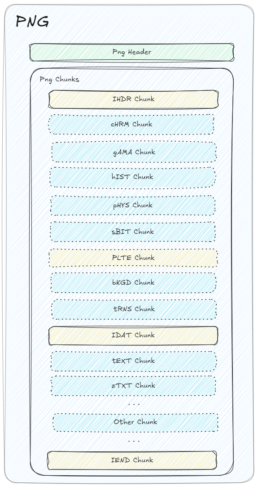

# Simple-png

### pure go png parse
 
 

### [PNG (Portable Network Graphics) Specification](https://www.w3.org/TR/PNG-Chunks.html)

```go

	open, err := os.Open("./png-format.png")
	if err != nil {
		panic(err)
	}
	p, err := ParsePng(open)
	if err != nil {
		panic(err)
	}
	// print png image data
	log.Println(*p.IDATs[0])
	// print png addition text
	log.Println(*p.TEXTs[0])
	
	// print other chunks
	for i := range p.chunks {
		log.Println(string(p.chunks[i].code[:]))
	}
```


### You also can custom chunk parse~

```go

    type CustomChunkParse struct {
	  // your struct 	
    }
    
    func (c *CustomChunkParse) ChunkName() ChunkName {
      return ChunkName("cust")
    }
    
    func (c *CustomChunkParse) Parse(chunk *chunk) error {
      // your custom parse
      return nil
    }
    
    func TestCustomChunk(t *testing.T) {
      open, err := os.Open("./png-format.png")
      if err != nil {
        panic(err)
      }
      p, err := ParsePng(open)
      if err != nil {
        panic(err)
      }
      c := &CustomChunkParse{}
      err = p.ParseChunk(c)
      if err != nil {
        panic(err)
       }
    }


```  


---  
# Png Struct   

  
  
   

---  
## TODO:
 - ADD EDIT 